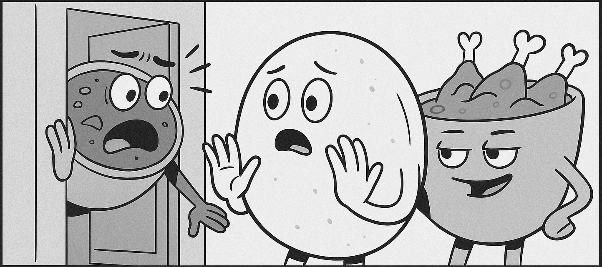

<html lang="en">
<head>
  <meta charset="utf-8" />
  <meta name="viewport" content="width=device-width,initial-scale=1" />
  <title>ESHWARI TIMES — Breaking: Idli Scandal</title>

  <!-- Fonts -->
  <link href="https://fonts.googleapis.com/css2?family=Libre+Baskerville:wght@400;700;900&family=Source+Sans+3:wght@300;400;600&display=swap" rel="stylesheet">

  
</head>

<body>
  

    <header class="mast" id="masthead">
      
ESHWARI TIMES

      
Serving the freshest scoop from the tiffin world — #DramaAtEshwari

    </header>

    <h1 class="headline">BREAKING: IDLI CAUGHT CHEATING ON SAMBAR WITH CHICKEN CURRY</h1>
    
A spicy new pairing rocks the batter community — eyewitness accounts and a leaked menu confirm the scandal.

    

      <!-- left column -->
      

        

          
        

        <article class="story" aria-label="Main article">
          
For decades, <strong>Idli</strong> and <strong>Sambar</strong> have been the most comfortable pairing on the breakfast table — unassuming, reliable and beloved by the city. But this past Sunday, eyewitnesses at <em>Eshwari Canteen</em> reported seeing Idli spending time with <strong>Chicken Curry</strong> near the steam counter.

          
“I saw them together,” said Dosa, who described the scene as “oddly aromatic.” Sources claim the chemistry between the two was immediate, spicy and unmistakable. Within hours, the canteen quietly added a new pairing to the menu: <strong>Idli + Chicken Curry</strong>.

          
Reactions split between outrage and curiosity. Longtime Sambar devotees expressed shock — while adventurous diners queued to try the forbidden combo. Sambar has not given an official statement, though close friends say she is taking time to simmer.

          
🗣️ <strong>Rumour Mill:</strong> Dosa seen flirting with Chukka Curry — Poori reportedly not amused.

          
The Eshwari Times will continue to follow the story and publish any fallout. For those tempted, the pairing is now available at the canteen.

        </article>
      

      <!-- right column / sidebar -->
      <aside class="side" aria-label="Sidebar">
        

          
PROOF

          
Leaked Menu Item — <strong>Idli + Chicken Curry</strong>

          

            <a class="btn btn-outline" id="view-menu" href="#">View full menu →</a>
          

        

        

          
WHERE

          
<a id="visitMap" href="#">Eshwari Canteen — Google Maps</a>

          

            
            
Scan to read on your phone

          

        

        

          
RUMOUR

          
Sources say the batter community is buzzing. Subscribe to stay ahead of the drama.

        

      </aside>
    

    

      
Taste the scandal — only at <strong>Eshwari Canteen</strong>

      

        <a class="btn btn-primary" id="orderNow" href="#">Order Online</a>
        <a class="btn btn-outline" id="visitNow" href="#">Visit Us</a>
      

    

    <footer>
      
© 2025 Eshwari Canteen · #DramaAtEshwari

      
Follow @eshwaricanteen · <a href="#" id="subscribeLink">Subscribe</a>

    </footer>
  

  
</body>
</html>
